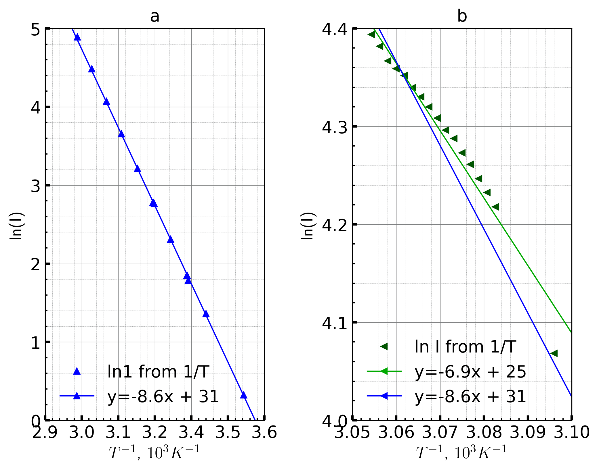

# ИЗУЧЕНИЕ ЗАВИСИМОСТИ СОПРОТИВЛЕНИЯ ПОЛУПРОВОДНИКА ОТ ТЕМПЕРАТУРЫ И ОПРЕДЕЛЕНИЕ ЭНЕРГИИ АКТИВАЦИИ ПОЛУПРОВОДНИКА
Выполнили:
Лузгина Арина, Ребрий Лидия, Замятин Алексей

# Таблица измерений
Постром по измереным данным табличку
| T,$^oC$          | T,K               | I,nA                | R, $\Omega$           | $\frac{1}{T}$, $K^{-1}$     | ln(I)                   |
|:-----------------|:------------------|:--------------------|:----------------------|:----------------------------|:------------------------|
| $-0.10 \pm 0.10$ | $273.05 \pm 0.10$ | $0.471 \pm 0.030$   | $42.5 \pm 2.7$        | $0.0036623 \pm 0.0000013$   | $-21.476 \pm 0.064$     |
| $10.00 \pm 0.10$ | $283.15 \pm 0.10$ | $1.375 \pm 0.030$   | $14.55 \pm 0.32$      | $0.0035317 \pm 0.0000012$   | $-20.405 \pm 0.022$     |
| $10.10 \pm 0.10$ | $283.25 \pm 0.10$ | $1.387 \pm 0.030$   | $14.42 \pm 0.31$      | $0.0035305 \pm 0.0000012$   | $-20.396 \pm 0.022$     |
| $20.20 \pm 0.10$ | $293.35 \pm 0.10$ | $3.880 \pm 0.030$   | $5.155 \pm 0.041$     | $0.0034089 \pm 0.0000012$   | $-19.3674 \pm 0.0077$   |
| $20.00 \pm 0.10$ | $293.15 \pm 0.10$ | $3.810 \pm 0.030$   | $5.249 \pm 0.042$     | $0.0034112 \pm 0.0000012$   | $-19.3856 \pm 0.0079$   |
| $24.90 \pm 0.10$ | $298.05 \pm 0.10$ | $5.950 \pm 0.030$   | $3.361 \pm 0.018$     | $0.0033551 \pm 0.0000011$   | $-18.9399 \pm 0.0050$   |
| $25.30 \pm 0.10$ | $298.45 \pm 0.10$ | $6.380 \pm 0.030$   | $3.135 \pm 0.015$     | $0.0033506 \pm 0.0000011$   | $-18.8701 \pm 0.0047$   |
| $30.00 \pm 0.10$ | $303.15 \pm 0.10$ | $10.060 \pm 0.030$  | $1.9881 \pm 0.0066$   | $0.0032987 \pm 0.0000011$   | $-18.4147 \pm 0.0030$   |
| $35.20 \pm 0.10$ | $308.35 \pm 0.10$ | $16.160 \pm 0.030$  | $1.2376 \pm 0.0030$   | $0.0032431 \pm 0.0000011$   | $-17.9407 \pm 0.0019$   |
| $34.90 \pm 0.10$ | $308.05 \pm 0.10$ | $15.850 \pm 0.030$  | $1.2618 \pm 0.0030$   | $0.0032462 \pm 0.0000011$   | $-17.9601 \pm 0.0019$   |
| $40.00 \pm 0.10$ | $313.15 \pm 0.10$ | $24.850 \pm 0.030$  | $0.8048 \pm 0.0015$   | $0.0031934 \pm 0.0000010$   | $-17.5104 \pm 0.0012$   |
| $45.10 \pm 0.10$ | $318.25 \pm 0.10$ | $38.660 \pm 0.030$  | $0.51733 \pm 0.00087$ | $0.00314218 \pm 0.00000099$ | $-17.06846 \pm 0.00078$ |
| $45.00 \pm 0.10$ | $318.15 \pm 0.10$ | $38.460 \pm 0.030$  | $0.52002 \pm 0.00088$ | $0.00314317 \pm 0.00000099$ | $-17.07365 \pm 0.00078$ |
| $50.00 \pm 0.10$ | $323.15 \pm 0.10$ | $58.470 \pm 0.030$  | $0.34206 \pm 0.00054$ | $0.00309454 \pm 0.00000096$ | $-16.65475 \pm 0.00051$ |
| $55.00 \pm 0.10$ | $328.15 \pm 0.10$ | $88.440 \pm 0.030$  | $0.22614 \pm 0.00035$ | $0.00304739 \pm 0.00000093$ | $-16.24094 \pm 0.00034$ |
| $60.00 \pm 0.10$ | $333.15 \pm 0.10$ | $132.810 \pm 0.030$ | $0.15059 \pm 0.00023$ | $0.00300165 \pm 0.00000090$ | $-15.83435 \pm 0.00023$ |

И график 

Таким образом получаем энергию активацию W = $0.7387 \pm 0.0025$ эВ, или $0.11835 \pm 0.00041$ аДж
