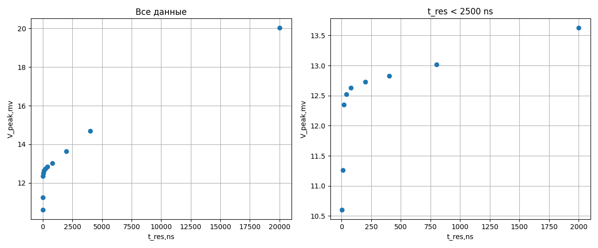
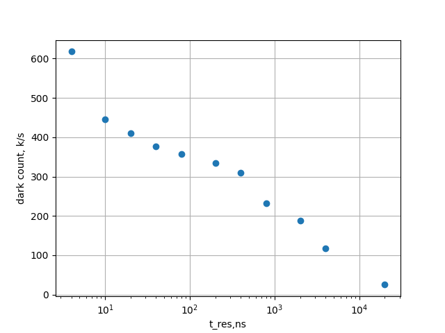

Измерение частоты темного счета и шум фактора SiPM
Выполнили:
Лузгина Арина, Ребрий Лидия, Замятин Алексей

# Выполнение

Шум осцилографа без усилителя  120 uV

Шум с усилителем 170 uV, но при этом сигнал усилился в k=10 раз, усилитель имба.

Шум электрониики + шум осцилографа 310uV.

Что на фоне полного шума порядка 3 mV почти незаметно

# Таблица измерений
| t_res,ns          | mean,mv            | std,mv            | hits,k            | dark_count, k/s   | std_detector   | ENF                   | n_e,M           |
|:------------------|:-------------------|:------------------|:------------------|:------------------|:---------------|:----------------------|:----------------|
| $4.0 \pm 0.0$     | $10.600 \pm 0.030$ | $3.432 \pm 0.030$ | $509.00 \pm 0.10$ | $617.7 \pm 0.0$   | $3418 \pm 30$  | $1.1040 \pm 0.0019$   | $3.3 \pm 1.1$   |
| $10.0 \pm 0.0$    | $11.260 \pm 0.030$ | $3.058 \pm 0.030$ | $601.30 \pm 0.10$ | $445.4 \pm 0.0$   | $3042 \pm 30$  | $1.0730 \pm 0.0015$   | $3.51 \pm 0.95$ |
| $20.0 \pm 0.0$    | $12.350 \pm 0.030$ | $3.156 \pm 0.030$ | $780.60 \pm 0.10$ | $410.8 \pm 0.0$   | $3141 \pm 30$  | $1.0647 \pm 0.0013$   | $3.85 \pm 0.98$ |
| $40.0 \pm 0.0$    | $12.520 \pm 0.030$ | $3.135 \pm 0.030$ | $407.10 \pm 0.10$ | $376.9 \pm 0.0$   | $3120 \pm 30$  | $1.0621 \pm 0.0012$   | $3.91 \pm 0.98$ |
| $80.0 \pm 0.0$    | $12.630 \pm 0.030$ | $3.138 \pm 0.030$ | $411.30 \pm 0.10$ | $357.7 \pm 0.0$   | $3123 \pm 30$  | $1.0611 \pm 0.0012$   | $3.94 \pm 0.98$ |
| $200.0 \pm 0.0$   | $12.730 \pm 0.030$ | $3.164 \pm 0.030$ | $377.10 \pm 0.10$ | $333.7 \pm 0.0$   | $3149 \pm 30$  | $1.0612 \pm 0.0012$   | $3.97 \pm 0.99$ |
| $400.0 \pm 0.0$   | $12.830 \pm 0.030$ | $3.228 \pm 0.030$ | $433.10 \pm 0.10$ | $309.4 \pm 0.0$   | $3213 \pm 30$  | $1.0627 \pm 0.0012$   | $4.0 \pm 1.0$   |
| $800.0 \pm 0.0$   | $13.020 \pm 0.030$ | $3.375 \pm 0.030$ | $304.80 \pm 0.10$ | $232.7 \pm 0.0$   | $3361 \pm 30$  | $1.0666 \pm 0.0012$   | $4.1 \pm 1.1$   |
| $2000.0 \pm 0.0$  | $13.630 \pm 0.030$ | $3.807 \pm 0.030$ | $220.80 \pm 0.10$ | $188.7 \pm 0.0$   | $3794 \pm 30$  | $1.0775 \pm 0.0013$   | $4.3 \pm 1.2$   |
| $4000.0 \pm 0.0$  | $14.680 \pm 0.030$ | $4.366 \pm 0.030$ | $399.80 \pm 0.10$ | $117.6 \pm 0.0$   | $4355 \pm 30$  | $1.0880 \pm 0.0013$   | $4.6 \pm 1.4$   |
| $20000.0 \pm 0.0$ | $20.040 \pm 0.030$ | $5.230 \pm 0.030$ | $53.50 \pm 0.10$  | $25.0 \pm 0.0$    | $5221 \pm 30$  | $1.06787 \pm 0.00081$ | $6.3 \pm 1.6$   |

# Построение графиков

При малых t_res амплитуда быстро растет из-за того, что  уменьшается количество лишних пиков, снятых из затухания/возрастания лавины

По перегибу можно оцениь время ловины около 50 нс

Темновой ток так же имеет перегибк около 50 нс из-за уменьшения количества детектирований 1 срабатывания несколькими пиками. Перегиб наблюдается, когда срабатывание детектируется в среднем 1-2 пиками

Для сопротивления нагрузки 50 Ом, можно оценить протекающий заряд в ловине как $4 \pm 1$ миллионов электронов