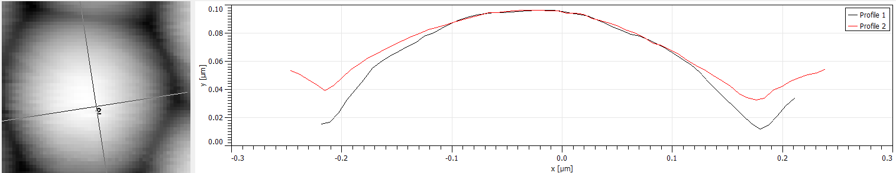

# Лабораторная работа  
## Атомно-силовая микроскопия

**Федеральное государственное автономное образовательное учреждение высшего образования**  
**«Московский физико-технический институт (национальный исследовательский университет)»**

МФТИ, 2025 год  

**Выполнили:**  
Дрязгов Владислав  
Замятин Алексей  

---

## Теоретические основы атомно-силовой микроскопии

Атомно-силовая микроскопия (АСМ) относится к методам сканирующей зондовой микроскопии и предназначена для исследования морфологии поверхности твёрдых тел с нанометровым и субнанометровым пространственным разрешением. В отличие от сканирующей туннельной микроскопии, АСМ не требует проводимости образца и может применяться к диэлектрическим, полупроводниковым и биологическим объектам.

Принцип работы АСМ основан на регистрации силового взаимодействия между остриём зонда и поверхностью образца. Зонд представляет собой наноразмерное остриё, расположенное на конце упругой консоли — кантилевера. Под действием сил зонд–образец кантилевер изгибается или изменяет параметры своих колебаний, что используется для восстановления топографии поверхности.

### Силы зонд–образец

Вблизи поверхности на зонд действует совокупность межатомных сил, включающая силы притяжения (ван-дер-ваальсовы, капиллярные) и силы отталкивания, обусловленные перекрытием электронных оболочек. В приближённом виде взаимодействие описывается потенциалом Леннарда–Джонса:
\[
U(r) = 4\varepsilon\left[\left(\frac{\sigma}{r}\right)^{12} - \left(\frac{\sigma}{r}\right)^6\right],
\]
где \( \varepsilon \) — глубина потенциальной ямы, \( \sigma \) — характерное расстояние взаимодействия. Соответствующая сила определяется как
\[
F(r) = -\frac{dU}{dr}.
\]
На больших расстояниях преобладает притяжение, на малых — отталкивание, что определяет различные режимы работы АСМ.

### Регистрация отклонений кантилевера

Для детектирования движения кантилевера используется оптическая система: лазерный луч фокусируется на тыльную сторону кантилевера и отражается на четырёхсекционный фотодиод. Смещение лазерного пятна приводит к изменению фототоков в секциях диода, что позволяет измерять изгиб кантилевера, а также амплитуду и фазу его колебаний с высокой чувствительностью.

### Колебательные режимы АСМ

В современных АСМ наиболее распространены колебательные режимы. Кантилевер возбуждается гармоническим сигналом с частотой, близкой к его резонансной частоте. Движение кантилевера можно описать уравнением вынужденных колебаний с затуханием:
\[
\ddot{z} + \frac{\omega_0}{Q}\dot{z} + \omega_0^2 z
= \frac{F_\text{exc}}{m}\cos(\omega t) + \frac{F_\text{int}}{m},
\]
где \( \omega_0 \) — собственная частота кантилевера, \( Q \) — добротность, \( F_\text{int} \) — сила взаимодействия зонда с поверхностью.

### Полуконтактный (tapping) режим

В данной работе используется полуконтактный режим (tapping mode). В этом режиме кантилевер совершает колебания с амплитудой порядка 10–100 нм и периодически касается поверхности образца. При взаимодействии с поверхностью изменяются амплитуда и фаза колебаний кантилевера вследствие диссипации энергии.

Формирование изображения происходит за счёт поддержания постоянной амплитуды колебаний кантилевера. Изменения амплитуды, вызванные неоднородностями рельефа поверхности, компенсируются системой обратной связи путём изменения положения пьезосканера вдоль оси \( Z \).

### Система обратной связи и фазовый контраст

Система обратной связи сравнивает текущую амплитуду колебаний кантилевера с заданным значением (set point). Разность между ними формирует сигнал ошибки, который поступает на PID-регулятор. Регулятор изменяет напряжение, подаваемое на пьезосканер, тем самым поддерживая постоянную амплитуду колебаний.

Дополнительным источником информации является фазовый сдвиг между возбуждающим сигналом и колебаниями кантилевера. Фазовый контраст чувствителен к диссипативным процессам и позволяет различать области поверхности с различными механическими и химическими свойствами, например органические загрязнения и кристаллические структуры.

---

## Исследование квантовых ям (InSb)

На исследуемой подложке предположительно присутствуют эпитаксиально сформированные наноструктуры InSb.

**Рисунок 1.** Обзорное АСМ-изображение области с наноструктурами.  

**Рисунок 2.** Увеличенное изображение отдельной области.  

Плотность объектов составляет порядка 5–6 на μm². Характерный латеральный размер составляет около 150 нм, высота — порядка 20 нм. Такая геометрия указывает на наличие квантового ограничения носителей заряда лишь в одном пространственном направлении — по нормали к поверхности, тогда как в плоскости структуры движение носителей остаётся квазисвободным.

Следовательно, данные наноструктуры корректно интерпретировать как **квантовые ямы**, а не квантовые точки в строгом физическом смысле. Подобные уплощённые островки роста обеспечивают одномерное квантование энергетического спектра и характерны для эпитаксиально выращенных полупроводниковых гетероструктур.

**Рисунок 3.** Детальное изображение отдельной квантовой ямы.  

**Рисунок 4.** Профиль высоты наноструктуры.  

---

## Исследование поверхности слюды

**Рисунок 5.** Область с резким ступенчатым перепадом высоты.  

Резкий перепад высоты представляет опасность для зонда, так как при недостаточно быстрой реакции системы обратной связи возможен удар кантилевера о поверхность.

**Рисунок 6.** Профили поверхности при пересечении ступени.  
  

Из профилей видно, что при прохождении ступени система обратной связи поднимает зонд, что приводит к смещению нулевого уровня высоты.

**Рисунок 7.** Профиль поверхности с двумя плёнками различной толщины.  

Наблюдается протяжённая ровная плёнка высотой порядка 80 нм и дополнительная плёнка меньшей толщины (~30 нм).

**Рисунок 8.** Трёхмерное изображение поверхности.  

**Рисунок 9.** Карта задержки фазы.  

Локальные области с повышенной задержкой фазы, вероятно, связаны с органическими загрязнениями или адсорбированной влагой.

---

## Исследование структуры опала

**Рисунок 10.** АСМ-изображение поверхности опала.  

Опал обладает характерной упорядоченной структурой, образованной сферическими частицами диоксида кремния \( SiO_2 \). Наблюдаются дефекты в виде частиц увеличенного размера.

**Рисунок 11.** Профиль отдельной сферическая частица опала.  

Радиус сферических частиц составляет порядка 250 нм.
