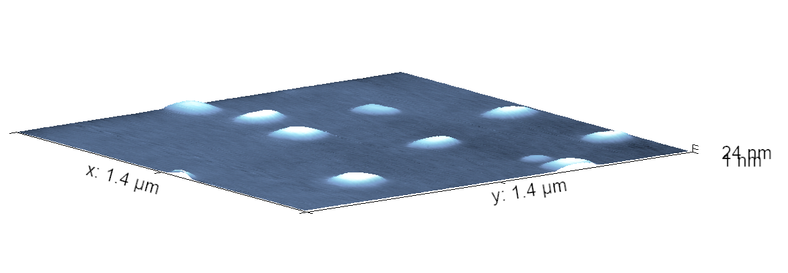
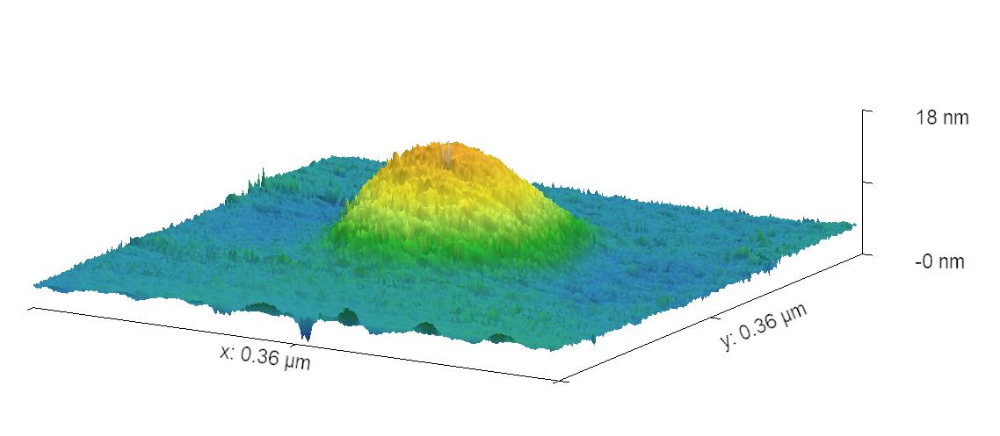
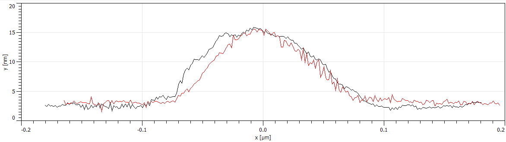
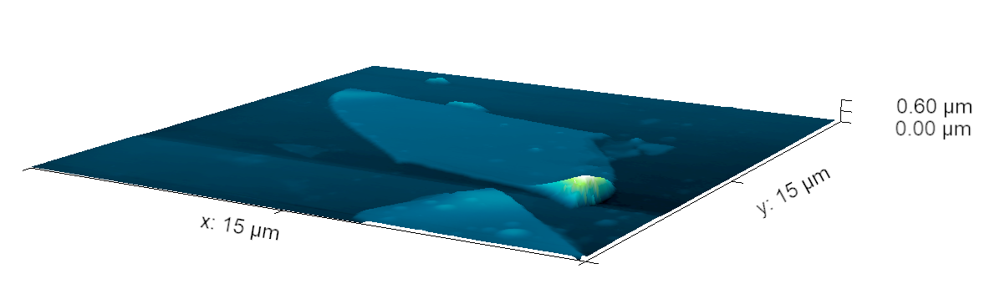
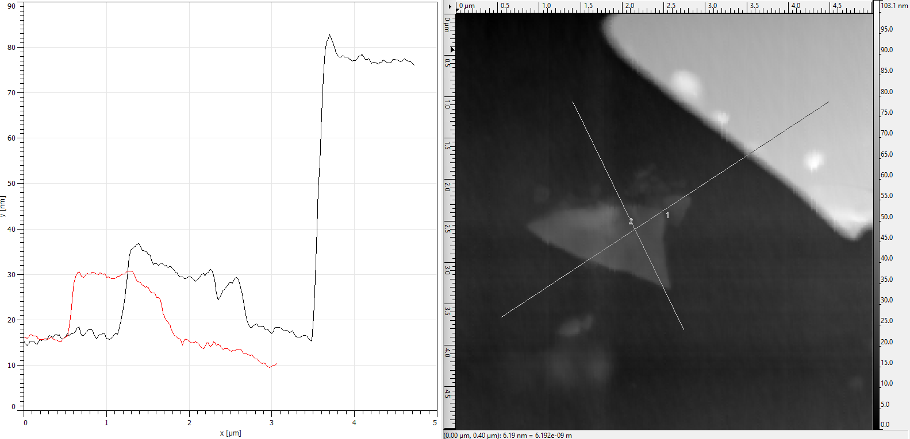
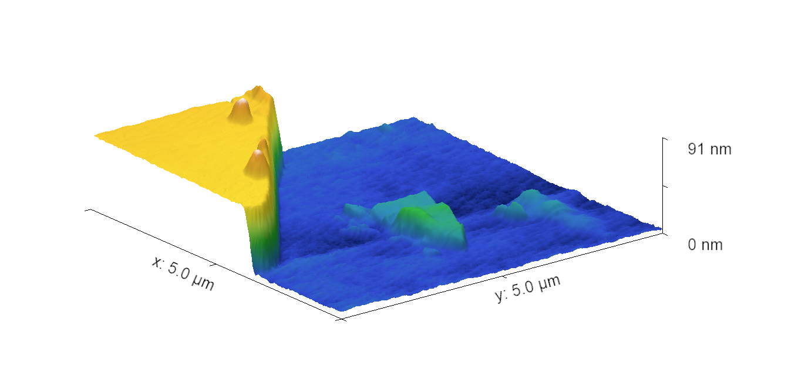
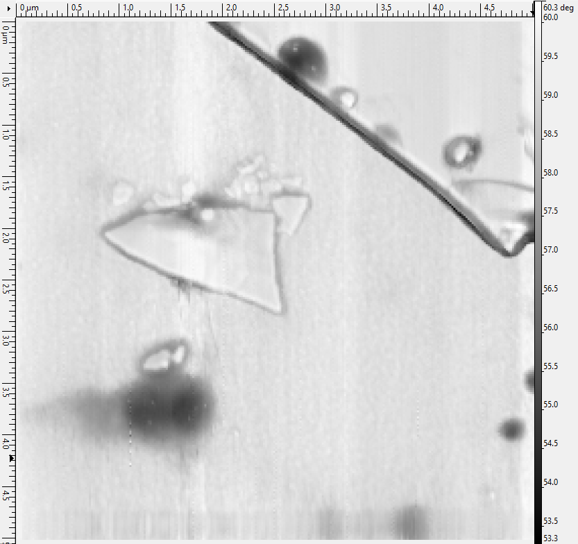

Лабораторная работа Атомно-силовая микроскопия
Выполнили Дрязгов Владислав и Замятин Алексей

## Теоретические основы атомно-силовой микроскопии

Атомно-силовая микроскопия (АСМ) относится к методам сканирующей зондовой микроскопии и предназначена для исследования морфологии поверхности твёрдых тел с нанометровым и субнанометровым пространственным разрешением. В отличие от сканирующей туннельной микроскопии, АСМ не требует проводимости образца и может применяться к диэлектрическим и биологическим объектам.

Принцип работы АСМ основан на регистрации силового взаимодействия между остриём зонда и поверхностью образца. Зонд представляет собой наноразмерное остриё, расположенное на конце упругой консоли — кантилевера. Под действием сил зонд–образец кантилевер изгибается или изменяет параметры своих колебаний, что используется для восстановления топографии поверхности.

### Силы зонд–образец

Вблизи поверхности на зонд действует совокупность межатомных сил, включающая силы притяжения (ван-дер-ваальсовы, капиллярные) и силы отталкивания, обусловленные перекрытием электронных оболочек. В приближённом виде взаимодействие описывается потенциалом Леннарда–Джонса:
\[
U(r) = 4\varepsilon\left[\left(\frac{\sigma}{r}\right)^{12} - \left(\frac{\sigma}{r}\right)^6\right],
\]
где \( \varepsilon \) — глубина потенциальной ямы, \( \sigma \) — характерное расстояние взаимодействия. Соответствующая сила определяется как
\[
F(r) = -\frac{dU}{dr}.
\]
На больших расстояниях преобладает притяжение, на малых — отталкивание, что определяет различные режимы работы АСМ.

### Регистрация отклонений кантилевера

Для детектирования движения кантилевера используется оптическая система: лазерный луч фокусируется на тыльную сторону кантилевера и отражается на четырёхсекционный фотодиод. Смещение лазерного пятна приводит к изменению фототоков в секциях диода, что позволяет измерять изгиб кантилевера и параметры его колебаний с высокой чувствительностью.

### Колебательные режимы АСМ

В современных АСМ наиболее распространены колебательные режимы. Кантилевер возбуждается гармоническим сигналом с частотой, близкой к его резонансной частоте. Движение кантилевера можно описать уравнением вынужденных колебаний с затуханием:
\[
\ddot{z} + \frac{\omega_0}{Q}\dot{z} + \omega_0^2 z = \frac{F_\text{exc}}{m}\cos(\omega t) + \frac{F_\text{int}}{m},
\]
где \( \omega_0 \) — собственная частота кантилевера, \( Q \) — добротность, \( F_\text{int} \) — сила взаимодействия зонда с поверхностью.

### Полуконтактный (tapping) режим

В данной работе используется полуконтактный режим (tapping mode). В этом режиме кантилевер совершает колебания с амплитудой порядка 10–100 нм и периодически касается поверхности образца. При взаимодействии с поверхностью изменяются амплитуда и фаза колебаний кантилевера вследствие диссипации энергии.

Формирование изображения происходит за счёт поддержания постоянной амплитуды колебаний кантилевера. Изменения амплитуды, вызванные неоднородностями рельефа поверхности, компенсируются системой обратной связи путём изменения положения пьезосканера вдоль оси \( Z \).

### Система обратной связи

Система обратной связи сравнивает текущую амплитуду колебаний кантилевера с заданным значением (set point). Разность между ними формирует сигнал ошибки, который поступает на PID-регулятор. Регулятор изменяет напряжение, подаваемое на пьезосканер, тем самым поддерживая постоянную амплитуду колебаний. Напряжение на пьезосканере, необходимое для компенсации изменений, используется для восстановления топографии поверхности.

Таким образом, в полуконтактном режиме АСМ изображение поверхности формируется по сигналу обратной связи при минимальном механическом воздействии зонда на образец.

### Измерение фазы колебаний

Так же важным источником информации является измерение задержки фазы колебаний кантилевера. Так можно оценить не только рельеф поверхности, но и отличить, например, органический налет (который создает большую задержку фазы) от кристаллических структур

## Квантовые точки
На подложки предположительно квантовые точки из InSb
 
Их плотность 5-6 точек на $\mu m^2$. Радиус 156 нм. Высота порядка 20 нм. Можно заметить что это скорее квантовые лужи, а не шарики и квантовыми точками они не являются.

## Слюда
 
Такой загиб может убить иголочку, если она не успеет подняться и ударится об него

Тут мы можем видить что при прохождении загиба пьеза подняла иголку чтобы не стукнуть ее и сбился ноль

На этом профиле видно что есть большая ровна бленка с высотой порядка 80 nm, и пленка поменьше с высотой порядка 30 нм.

Тут есть рофл с тем, что есть какие-то пятнышки, на которых происходит большая задержка фазы. Скорее всего это органика или вода 

## Опал

Опал имеет красивую ронвую структуру из шариков $SiO_2$ с большим количеством деффектов в виде больших шариков.

Шарики имеют радиусы около 250 нм
